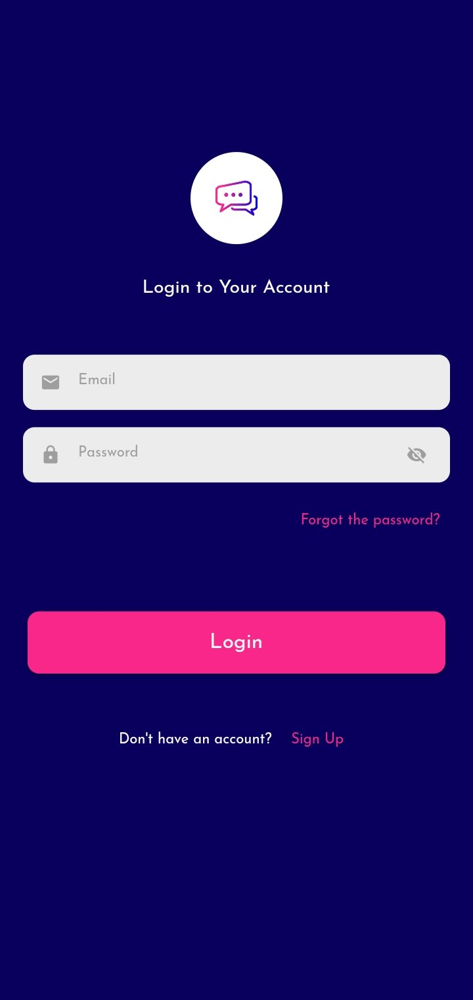
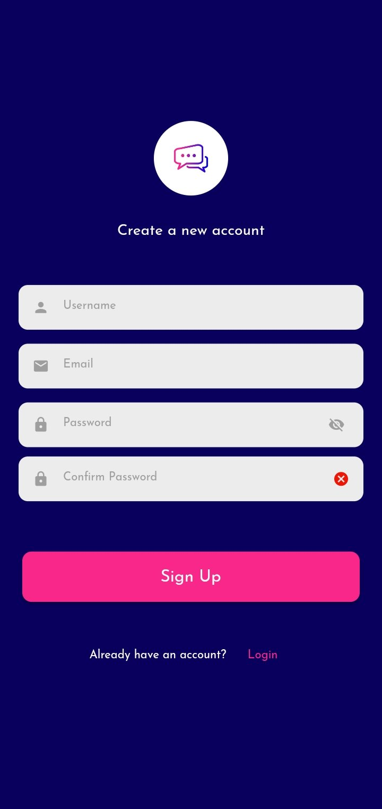

# ChatMe

Welcome to ChatMe! This Flutter-based chat application allows users to communicate seamlessly with friends and family.

## Requirements
- Flutter SDK
- Dart SDK
- Other dependencies mentioned in `pubspec.yaml`
- Android or IOS device

## Features
- Real-time messaging
- User authentication
- Image and file sharing
- Push notifications

## Walkthrough
- 

https://github.com/Qweku/chat-me/assets/79706544/c17e9548-5d9f-4077-a3c1-c7a3fa7ec779

## Screenshots

| Login | Sign Up | Chat List |
|-------------|--------------|------------|
|  |  |  |

| Chats | User Profile | xxxxx |
|-------------|--------------|------------|
|  |  |

## Major Packages
- `firebase_core: ^x.x.x`
- `firebase_auth: ^x.x.x`
- `cloud_firestore: ^x.x.x`
- `http: ^x.x.x`
- Other packages as listed in `pubspec.yaml`

## Authors
- [Collins Brobbey Jnr](https://github.com/Qweku)
- [Jeffrey Boahen](https://github.com/yellow_Flickr)
